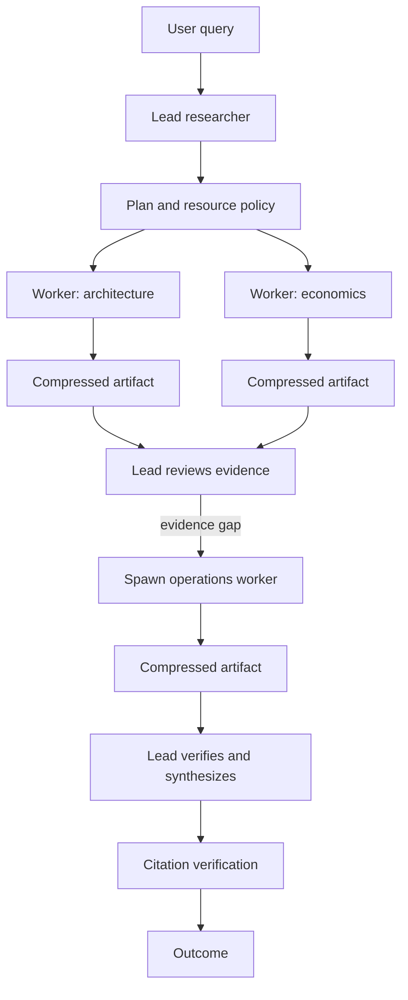

# Dynamic Multi-Agent Research

This lesson implements the orchestrator–worker architecture described in Anthropic's
[multi-agent research engineering article](https://www.anthropic.com/engineering/multi-agent-research-system).
It focuses on the mechanism that creates value: independent search trajectories with
separate local contexts, followed by evidence compression and global synthesis.

The demo is deterministic and offline. It makes concurrency, budgets, checkpoints,
telemetry, and evaluation reproducible before introducing paid model calls.

## The architecture



The graph is not fully known at startup. The `operations` branch appears only after the
lead reviews the first wave and detects an evidence gap.

## Article concept → implementation

| Concept | Implementation |
|---------|----------------|
| Find independence before adding agents | `parallelism_profile()` calculates width and critical path |
| Lead owns strategy and stopping | `LeadResearcher` protocol and `ReviewDecision` |
| Workers own bounded local exploration | `ResearchWorker` and `WorkerBudget` |
| Search is compression | `CompressedArtifact` excludes raw observations and exposes a ratio |
| Multi-agent scales test-time compute | `resource_policy()` allocates tokens, calls, tasks, waves, and workers |
| Dynamic execution graph | A review can return new tasks after each evidence wave |
| Inter-agent parallelism | The orchestrator runs ready workers with `asyncio.gather()` |
| Intra-agent tool parallelism | `DemoWorker` launches its local searches with another `gather()` |
| Memory is durable run state | Atomic `JsonCheckpointStore` checkpoints every wave |
| Resume instead of restart | Completed artifacts survive a worker failure and are not rerun |
| System telemetry | Tokens, tool calls, failures, compression, and checkpoints |
| Behavior telemetry | Planning, delegation, graph expansion, review, and stopping |
| Outcome over exact path | Two different recorded trajectories satisfy the same Lesson 09 eval case |

## Why the graph profile matters

For equal-duration tasks, the lesson estimates available parallelism as:

```text
theoretical speedup = task count / critical path length
```

Three independent tasks have width 3 and critical path 1. A chain `A → B → C` has width
1 and critical path 3. The latter does not become meaningfully faster by adding agents.

This is an intentionally simple estimator—not a production scheduler—but it makes the
architectural decision inspectable and testable.

## Global context versus local context

Workers may inspect a comparatively large local corpus. They return only:

- a short summary;
- claim/evidence/source tuples;
- uncertainty;
- resource usage;
- compression metadata.

Raw observations never enter `ResearchState` or the lead interface:

```text
large worker-local context
          ↓
filter + verify + compress
          ↓
small CompressedArtifact
          ↓
lead global state
```

This prevents the lead context from growing in proportion to every worker's search history.

## Resource policy

`resource_policy()` defines three explicit compute classes:

| Class | Intended shape | Workers | Global token budget |
|-------|----------------|---------|---------------------|
| Simple | One bounded fact lookup | 1 | 1,500 |
| Comparison | Several independent axes | 4 | 10,000 |
| Complex | Broad, valuable investigation | 8 | 30,000 |

The numbers are teaching defaults, not Anthropic production settings. The important idea is
that complexity maps to explicit tokens, tool calls, workers, tasks, waves, and artifact size.

Each wave divides the remaining global budget among selected workers. The harness verifies
both per-worker and aggregate usage.

## Failure and resume

After every wave, the orchestrator atomically saves:

- the plan and dynamic tasks;
- completed compressed artifacts;
- failed task IDs;
- consumed resources;
- wave and run status.

If one worker fails, successful siblings remain checkpointed. Rerunning the same `run_id`
retries only unfinished work. See
`test_checkpoint_resume_keeps_completed_work_and_retries_only_the_failure` for the complete
exercise.

## Observability

The recorder separates two telemetry categories:

| Category | Examples |
|----------|----------|
| System | failure type, tokens, tool calls, compression ratio, checkpoint count |
| Behavior | plan shape, selected workers, delegation, new tasks, review decision |

Telemetry intentionally excludes the raw user query. A production system would also redact
tool arguments, evidence content, and identifiers according to its privacy policy.

## Run the demo

```bash
python multi_agent/01_dynamic_research/demo.py
```

It creates ignored local state under `.demo_state/` and prints:

- the synthesized answer and citations;
- two execution waves;
- three completed worker trajectories;
- nested search concurrency;
- estimated tokens and tool calls;
- per-worker compression ratios;
- an exported Lesson 09 evaluation trial.

Use a stable ID to exercise resume behavior after introducing a failure:

```bash
python multi_agent/01_dynamic_research/demo.py --run-id my-research-run
```

## Learn from the commits

1. `test: define dynamic multi-agent research behavior` — intentional red state.
2. `feat: implement dynamic multi-agent research graph` — orchestration becomes green.
3. `docs: map Anthropic multi-agent research into executable lessons` — evaluation fixtures,
   article mapping, repository navigation, and CI validation.

Inspect them in order:

```bash
git log --reverse -- multi_agent tests/test_dynamic_multi_agent.py
```

## What this implementation does not claim

- The deterministic demo does not prove a quality gain over a model-backed single agent.
- Estimated tokens are not API billing measurements.
- The resource numbers are examples, not universal scaling laws.
- A keyword/source grader cannot prove semantic truth.
- Synchronous waves still create a straggler barrier; fully asynchronous steering would add
  state-consistency and error-propagation complexity.

The next experiment should implement model-backed lead/worker adapters and compare them with
a single-agent baseline using the same outcome eval cases, cost budget, and source corpus.

## References

- [How we built our multi-agent research system](https://www.anthropic.com/engineering/multi-agent-research-system)
- [Effective context engineering for AI agents](https://www.anthropic.com/engineering/effective-context-engineering-for-ai-agents)
- [Demystifying evals for AI agents](https://www.anthropic.com/engineering/demystifying-evals-for-ai-agents)
